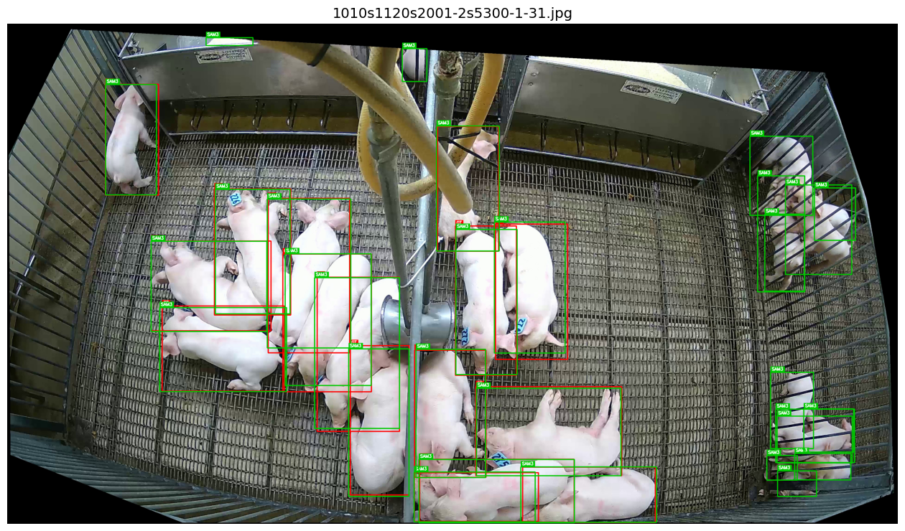
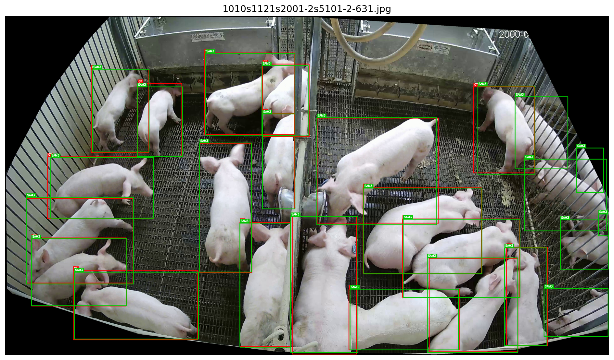

# Data Distillation (or Weak label annotation?) Experiment

## 1. Baseline: Supervised Learning (Human Labels)
*Performance of YOLOv8 trained directly on the original PigLife human-annotated dataset.*

*Using torchmetrics*
| Model   | mAP_50-95 | mAP_50 | mAP_75 | AP_Medium | AP_Large |
|---------|-----------|--------|--------|-----------|----------|
| yolov8n | 88.13     | 98.94  | 95.75  | 40.20     | 88.54    |
| yolov8s | 90.57     | 98.97  | 96.89  | 42.30     | 90.88    |
| yolov8m | 91.84     | 98.98  | 97.78  | 42.11     | 92.04    |

*Using pycocotools*
| Model          | mAP_50-95 | mAP_50 | mAP_75 | AP_Medium | AP_Large |
|----------------|-----------|--------|--------|-----------|----------|
| yolov8n        | 88.14     | 98.94  | 95.75  | 40.20     | 88.55    |

## 2. Teacher Baseline: SAM3 Zero-shot Performance
*Evaluated on the PigLife Test Set (Human Ground Truth).*

| Model          | mAP_50-95 | mAP_50 | mAP_75 | AP_Medium | AP_Large |
|----------------|-----------|--------|--------|-----------|----------|
| zero-shot SAM3 | 80.73     | 93.61  | 88.38  | 3.74      | 81.12    |

### Observations on Ground Truth Quality
That is a discrepancy between SAM3 predictions and Human Ground Truth:

**1. "False Positives" are actually Unlabeled Pigs:**
SAM3 successfully detects pigs that were missing from the human annotations (likely background pigs or piglets intentionally ignored by annotators). These correct detections are penalized as "False Positives" by the mAP metric.

  
  
  
<em>Figure 1 & 2: SAM3 detections (green) identifying pigs not present in Ground Truth.</em>

**2. Impact on Small/Medium Object Metrics:**
The low score on `AP_Medium` (3.74%) correlates with the observation above. The unlabeled background pigs are typically smaller/medium-sized due to distance, leading to a skewed performance metric for those size categories.

---

## 3. Student Performance: Distilled YOLOv8
*YOLOv8 models trained on **SAM3-generated pseudo-labels** (not human labels).*

### 3.1 Validation Performance (vs. SAM3 Labels)
*How well did the student learn to mimic the teacher?*

| Model | Params (M) | mAP@50 | mAP@50-95 | Latency (ms) | FPS |
| :--- | :---: | :---: | :---: | :---: | :---: |
| **YOLOv8n** | 3.0 | 95.99% | 84.57% | 5.66 | 177 |
| **YOLOv8s** | 11.1 | 96.70% | 87.53% | 6.12 | 163 |
| **YOLOv8m** | 25.9 | **97.08%** | **88.77%** | 14.90 | 67 |

### 3.2 Test Performance (vs. Human Ground Truth)
*How well does the student perform on the real-world task?*

> **Note:** We've got that warning: "UserWarning: Encountered more than 100 detections in a single image. This means that certain detections with the lowest scores will be ignored, that may have an undesirable impact on performance. Please consider adjusting the `max_detection_threshold` to suit your use case."

| Model   | mAP_50-95 | mAP_50 | mAP_75 | AP_Medium | AP_Large |
|---------|-----------|--------|--------|-----------|----------|
| yolov8n | 76.79     | 93.26  | 86.30  | 4.83      | 77.17    |
| yolov8s | 78.76     | 93.61  | 87.74  | 6.31      | 79.13    |
| yolov8m | 79.38     | 93.55  | 88.21  | 6.53      | 79.80    |