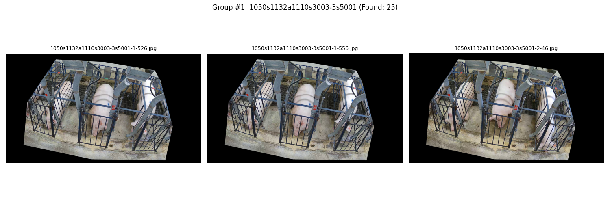
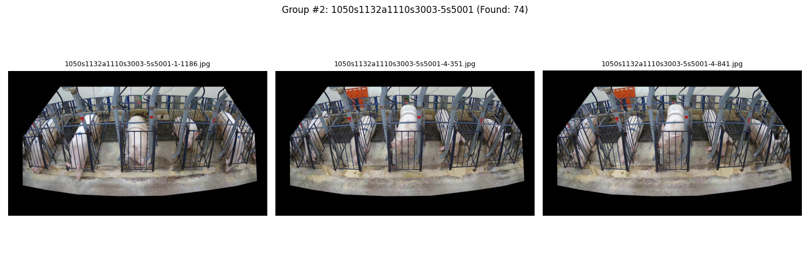
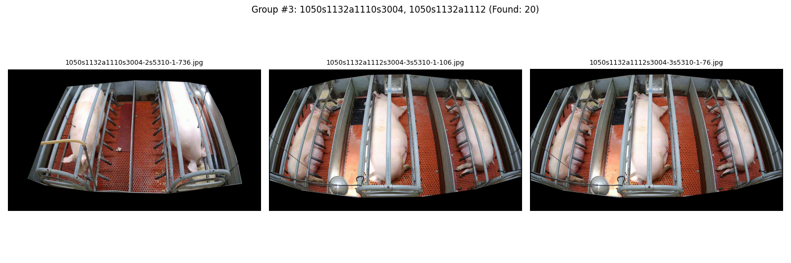
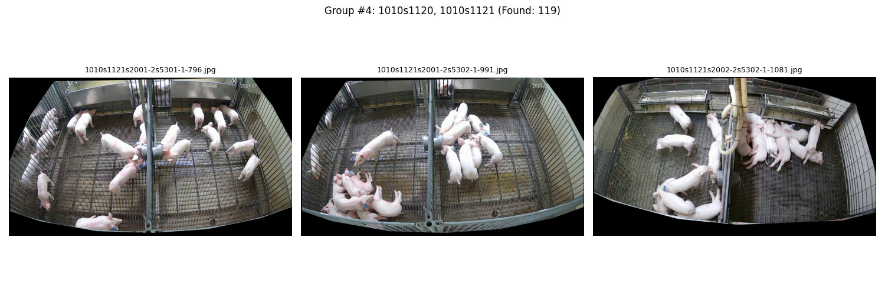
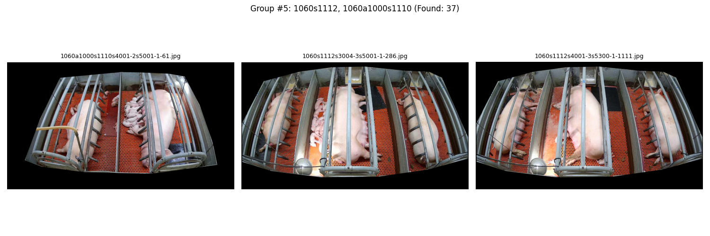
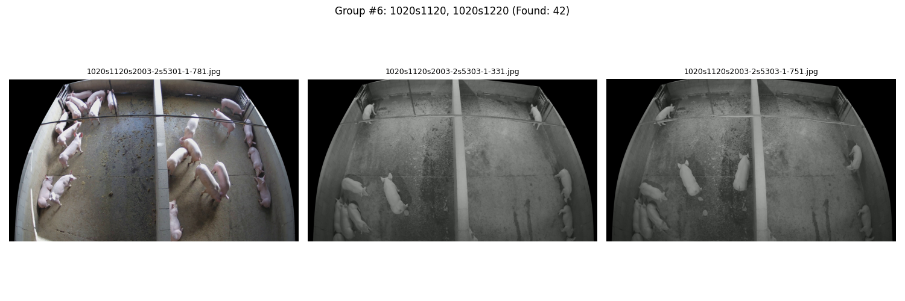
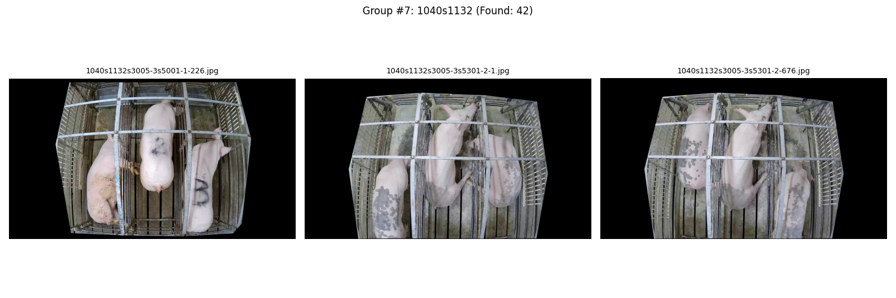
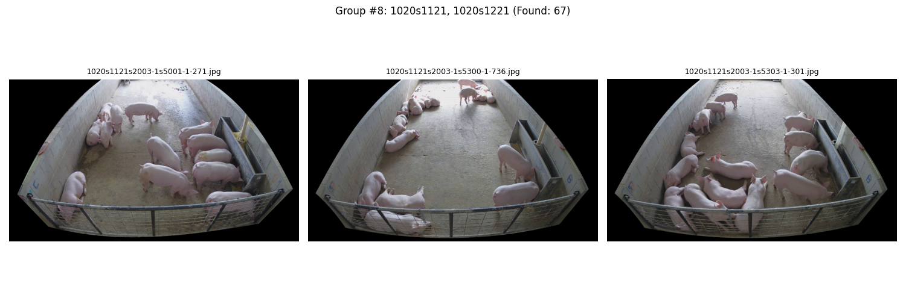

# Scenario Visual Report

Generated pipeline run.

---

### Group 1
**Filter IDs:** `1050s1132a1110s3003-3s5001`
**Total Images Available:** 25

---

### Group 2
**Filter IDs:** `1050s1132a1110s3003-5s5001`
**Total Images Available:** 74

---

### Group 3
**Filter IDs:** `1050s1132a1110s3004, 1050s1132a1112`
**Total Images Available:** 20

---

### Group 4
**Filter IDs:** `1010s1120, 1010s1121`
**Total Images Available:** 119

---

### Group 5
**Filter IDs:** `1060s1112, 1060a1000s1110`
**Total Images Available:** 37

---

### Group 6
**Filter IDs:** `1020s1120, 1020s1220`
**Total Images Available:** 42

---

### Group 7
**Filter IDs:** `1040s1132`
**Total Images Available:** 42

---

### Group 8
**Filter IDs:** `1020s1121, 1020s1221`
**Total Images Available:** 67

---

